# The judge pipeline

!!! note "Optional reading"
    You don't need any of this to use Romp.
    Describes the system as of **2026-07-20**; the behaviour it documents moves,
    so treat anything here as a snapshot rather than a contract.

Every state on the board is a replay of appended events. Judges append, your
actions append, and nothing edits state in place, so any behavior can be
walked back to the events that produced it. This page shows who appends what,
in which order, and where each record lives. Companion detail:
[judges.md](judges.md) (per-judge prompts and triggers) and
[goal-state.md](goal-state.md) (the state model).

Reading the diagrams: blue = an LLM board judge (writes goal state), green =
an LLM caption judge (writes only text), gray = deterministic code, yellow =
data at rest, pink = you. A solid arrow always follows; a dashed arrow fires
only when its condition holds.

## The whole system

The system-level map, transcripts and mail in and the board out, judges
between two deterministic layers, is on
[How Romp works](architecture.md). This page drills into when each judge runs,
tier by tier, and how a card's state is a replay of its log.

Order within one pass: planner, closer, unblocker, courier, propagate
(deterministic check-off of delegated work), grouper, consolidator,
distiller + briefer.
Every LLM call goes through one door that skips calls while an account usage
window is exhausted, turns an API error reply into a logged call failure
(never parser input), and logs cost per judge, one name per distinct prompt.
Every judge gives up loudly after three rejected replies on the same work
item and re-arms on its own event (judges.md, "When a judge fails"). A
separate index tier (captioner, gister, archiver) writes the chat and
timeline captions; it never touches goals.

## When each judge runs

A turn is your message, the work it causes, and the stop at the end. A
segment is one input and its work; a turn can hold several (your message,
then a peer's message, each with its own work). The two tiers are separate
systems, so each gets its own figure.

**The caption tier** (green) writes the words you read — chat, timeline,
search — and never touches a card. Every arrow is unconditional.

{ width="100%" }

**The board tier** (blue) files and rules. A solid arrow always follows; a
dashed arrow fires only when the gray gate on its path holds — the gates
are deterministic checks, not model calls, and they are why nothing here
follows the clock.

{ width="100%" }

Edge colors trace sources, nothing more: the planner's arrows wear the
light blue of its border, the closer's the dark blue of its border, yours
are pink; everything else (opener, courier, plan-sync) leaves from an
adjacent box and needs no tint. The planner and closer are not
alternatives: every segment's work is filed by the planner, including the
turn's last, and the closer then runs once more at turn end to audit the
goals the whole turn touched.

There is no clock and no concurrency between these judges: one triage pass
runs them in strict order — planner, closer, unblocker, courier, propagate,
grouper, consolidator, then distiller + briefer — so a card a judge touches
is distilled by the same pass, never left half-made across passes. The feed renders from a snapshot taken at pass start, so
mid-pass intermediate states never flicker through. Your own actions are
the one write the pass cannot order: they land the moment you click,
journaled as events (cleared.jsonl, overrides/) and replayed at load, so a
pass racing your resolve cannot lose it. Judges whose model call spans
seconds (the unblocker) hold no store copy across the call: verdicts apply
to a fresh load afterwards, and a node whose state moved on mid-call is
skipped with a `drift-skip` row in judge-errors.jsonl — the race is
observable, never silently absorbed.

The diamond gates are the event gating: the grouper keys on the set of open
cards (top-level ids) and the consolidator on the set of completed cards,
so they run after any source that changes those sets — the filing judges,
the courier's planted goals, the plan-sync mirrors, or your own
clear/resolve/undo — and stay silent when a pass changes nothing. The
distiller and briefer key on a single card's state (completed-and-settled,
blocked) regardless of which judge put it there. The placer is the
planner's second, scoped call only: the opener and the live re-plan always
hard-place at card level.

The board judges, with what each one reads and the ops it may emit:

| Judge | Fires when | Reads | May do |
|---|---|---|---|
| opener | your message lands, work still running | the message + the open-card tree | exactly one op: `mint`, or `sub` under an open card |
| planner | a segment's work ends | the work + the tree | `mint`, `sub`, `done`, `block`, `retitle`, `skip` |
| placer | the planner filed under a card that has open sub-goals | that card's subtree only | pick the level inside the card |
| closer | the turn ends | the goals this turn touched | `done`, `block`, omit (when in doubt, omit) |
| unblocker | an open blocked goal has ended turns or done filings newer than its block (or its last check of each) | the goal's question + the conversation since + the goals completed since | `lift`, `hold` (when unsure, hold) |
| courier | a peer message arrives | the message + both sessions' trees | plant a goal + tracking node, or nothing |
| grouper | the set of open cards changed | open top cards | merge twins, split a tangent, retitle, nothing |
| consolidator | the set of completed cards changed | completed top cards | the same ops, done column |
| distiller | a card completed and settled | the card's whole work (or the delta since a reopen) | background + takeaway |
| briefer | a card blocked | the blocking stretch | the decision brief |

Two special inputs change how the planner reads a segment: a segment opened
by a goal-tagged nudge must resolve that goal (done or block, no plain
step), and a segment opened by an untargeted kernel notice (restart/resume)
carries a housekeeping note, so a post-restart verification sweep files
nothing instead of minting its own card.

## Placement is one question: which card

For each segment the planner answers: which open card could not be called
done without this work? No card qualifies, mint a new one. Everything after
that answer is mechanical, including where inside the card the work lands.

{ width="100%" }

Timing details that matter when auditing: a user message is placed twice.
The opener files it the moment it lands (card level only, so the board
updates instantly); the planner's work run refines at turn end and may add,
complete, block, or retitle. A placer or opener failure files at the card,
never nowhere, and logs to judge-errors.jsonl. The same-title guard is exact
string equality, and a completed sibling never matches, so repeated steps
still get their own nodes.

## A node's state is a replay of its log

Nothing stores "blocked" or "done" as a fact. Each node carries an
append-only log of events, each stamped with its source (planner, closer,
unblocker, courier, nudge, interrupt, romp, user, agent) and reason; the visible state
is a fold over that log. A direct state write raises at the write site. The
grouper and consolidator never appear as sources: they move whole subtrees,
they never judge.

{ width="100%" }

Three derived flags answer the questions the chart cannot:

| Flag | Meaning | Cleared by |
|---|---|---|
| held | you asserted "not done" and no judge has answered | any later non-user event on the node |
| followupPending | your reply is being re-judged (the card's swirl) | the planner's next verdict, or a pivot |
| stale-verdict guard | a done/block computed from evidence at or before your last reply is refused | newer evidence |

## Three columns, one precedence

The rollup folds a card's subtree into a column, in this order:

1. Any open descendant blocked, or the card itself: **Needs you**.
2. Subtree done and settled, and the card is not held: **Completed**.
3. Otherwise: **Working**.

Two overrides sit above the judges: an open item on the agent's own to-do
list holds its card in Working regardless of verdicts, and your actions
(clear, resolve, move) outrank both. Completion sticks via a settle event,
so a finished card does not flicker back to Working when late work trickles
in; only a real follow-up reopens it.

## Peer mail: the sender declares, the courier verifies

A sender must declare each message delegate, coordinate, or question in the
send call itself; the courier takes the declaration as a strong prior and
reads the body for the receiving-side truth. Only a real handoff makes
cards: one in each tree, linked, and the link checks itself off.

{ width="100%" }

## Walk any surprise back to its cause

| Question | Read this |
|---|---|
| why is this card in this state? | the node's `log` in `goals/<sid>.json`: every event has source, kind, reason, time |
| why was this work filed here? | `placements` in the store, plus the node's `why` and `trail` |
| why did this mint at top level? | the node's `why`: "declared in the agent's own to-do list" means the plan-sync mirror, and nesting it is the grouper's job; anything else is the planner |
| did a judge fail or get skipped? | `judge-errors.jsonl`: every row carries judge, session, kind (parse, call, give-up, cite-miss, rate-limited, task-store, history-unreadable, drift-skip), and the evidence (reply tail, API message, re-arm event) |
| what did a judge call cost, and when? | `judge-usage.jsonl`, per judge and session |
| what happened to a peer message? | `timeline/messages.jsonl` by message id, plus the delivered markers in the transcript |
